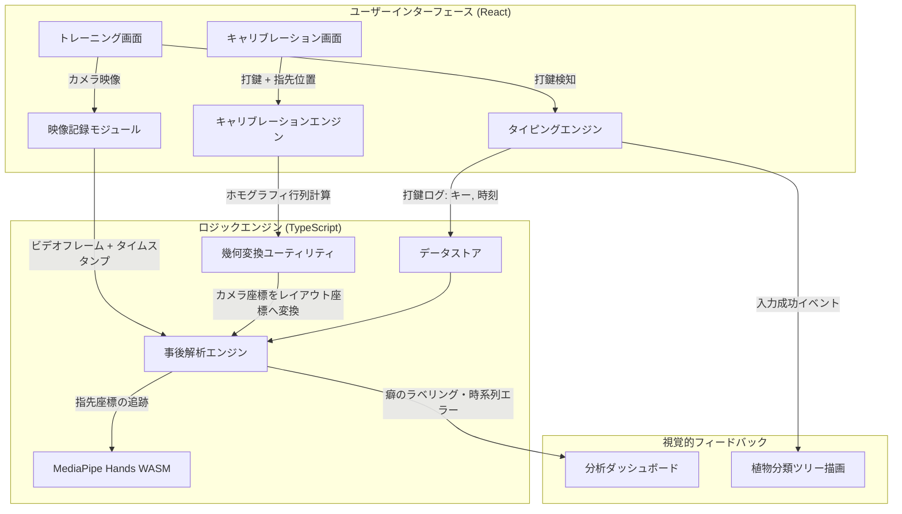

# **技術設計仕様書：SpartanType Web**

作成日: 2026年6月16日
ステータス: 提案中

---

## **1. 技術スタックの選定**

クライアントサイド完結型で高速かつ安定した画像認識と滑らかなビジュアル表現を実現するため、以下の技術スタックを選定します。

| レイヤー | 技術 | 選定理由 |
| :--- | :--- | :--- |
| **開発基盤 / ビルダー** | **Vite** | 超高速な開発サーバー起動と効率的なビルド。 |
| **言語** | **TypeScript** | 幾何計算（ホモグラフィ）や打鍵ログなど、複雑なデータ構造の型安全性を担保。 |
| **UIフレームワーク** | **React** | ダッシュボード、設定画面、キャリブレーション等のコンポーネント管理と状態遷移の制御のしやすさ。 |
| **スタイリング** | **Vanilla CSS (Modern CSS)** | CSSカスタムプロパティ（変数）を用いたデザインシステム、Glassmorphism等のプレミアムなUIデザインの自由度最大化。 |
| **ハンドトラッキング** | **MediaPipe Tasks Vision (Web)** | ブラウザ上で高速・低レイテンシで手および指先の骨格（21個の3D関節）を検出するためのデファクトスタンダード。 |
| **視覚表現 (ツリー / グラフ)** | **HTML5 Canvas / SVG (一部 D3.js)** | 植物分類ツリーの滑らかなアニメーション成長と、ヒートマップ・分析タイムラインの描画。 |
| **幾何計算 (ホモグラフィ)** | **自作線形代数ユーティリティ (純TS)** | 4点〜N点対応の最小二乗ホモグラフィ行列（SVDを用いた線形解法）を依存関係なしで軽量実装。 |

## **1.1. パフォーマンス最適化戦略（ReactとCanvasの役割分担）**

タイピングアプリにおいてミリ秒単位の打鍵感と、カメラ映像の60fps描画を維持するため、描画エンジンとUI管理フレームワークの役割を厳密に分離します。

* **Reactの役割（状態管理と静的UI）:**
  * 設定画面、ダッシュボード、ツリー構造の論理データ、タイピングテキストの現在の位置などの「状態」のみを管理。
  * 60fpsで頻繁に再描画（Re-render）される仮想DOMループにはReactを一切関与させず、不要なレンダリングオーバーヘッドを完全にゼロにします。
* **HTML5 Canvas / WebGLの役割（高頻度レンダリング）:**
  * カメラ映像のフレーム取得、MediaPipeによる骨格オーバーレイ、および植物分類ツリーのアニメーション描画は、Reactからマウントされた専用の `<canvas>` 要素に対して、ブラウザの原生的な `requestAnimationFrame` ループで直接描画します。
  * キャンバスへのアクセスは `useRef` を介して生のDOMとして操作し、完全なVanilla JS/TSと同等の描画パフォーマンスを担保します。

---

## **2. フォルダ構成**

プロジェクトルートにVite + React + TS環境を構築し、ロジックとUIを厳密に分離したモジュール設計を行います。

```text
spartan-type-web/
├── docs/                               # 各種ドキュメント（要件定義書、技術設計書など）
├── public/                             # MediaPipeのWASMモデルファイル、静的アセット
├── src/
│   ├── assets/                         # 画像、アイコン、効果音等
│   ├── components/                     # UIコンポーネント
│   │   ├── trainer/                    # トレーニング画面（タイピング、カメラプレビュー）
│   │   ├── dashboard/                  # 分析ダッシュボード、ヒートマップ、タイムライン
│   │   ├── calibration/                # キャリブレーション指示・調整UI
│   │   ├── tree/                       # 植物分類ツリービジュアライザー
│   │   └── common/                     # ボタン、モーダルなどの共通UIコンポーネント
│   ├── hooks/                          # カスタムHooks（Webcam管理、MediaPipe管理など）
│   ├── styles/                         # スタイル定義
│   │   ├── index.css                   # グローバルスタイル、CSS変数テーマ定義
│   │   └── variables.css               # 色、アニメーション、タイポグラフィのトークン
│   ├── types/                          # 型定義ファイル（KLE, Keystroke, Calibrationなど）
│   ├── utils/                          # ヘルパー・アルゴリズム関数群
│   │   ├── homography.ts               # 射影変換（ホモグラフィ計算、逆変換）の数学エンジン
│   │   ├── kleParser.ts                # Vial/KLEレイアウトJSONのパース処理
│   │   └── habitAnalyzer.ts            # 「指サボり型」などの打鍵癖分析ロジック
│   ├── App.tsx                         # アプリケーション全体のルーティングとメインコンテキスト
│   └── main.tsx                        # エントリーポイント
├── package.json
├── tsconfig.json
└── vite.config.ts
```

---

## **3. 主要システムアーキテクチャ**



---

## **4. 主要モジュール設計**

### **4.1. 幾何変換エンジン (`homography.ts`)**
4点（またはN点）のキャリブレーション点から、レイアウト上の設計座標 \((x, y)\) とカメラ上のピクセル座標 \((px, py)\) の相互変換を行う。

* **ホモグラフィ行列の計算:**
  * 与えられた \(N \ge 4\) 個の対応点 \((x_i, y_i) \leftrightarrow (px_i, py_i)\) に対し、Direct Linear Transformation (DLT) を用いて \(3 \times 3\) の射影変換行列 \(H\) を求める。
  * \(N > 4\) の場合は、最小二乗法を用いて再投影誤差が最小となる最適な行列を算出する。
* **双方向変換インタフェース:**
  * `layoutToCamera(x, y): [px, py]` - キーボード上のキー位置をカメラ映像上にポリゴンとして描画する際に使用。
  * `cameraToLayout(px, py): [x, y]` - 検出した指先のカメラ座標が、キーボードのどの座標に対応するかを判定する際に使用。

### **4.2. キャリブレーションエンジン (`calibration/`)**
段階的かつストレスのないキャリブレーションフローを提供する。

* **簡易プリセット適用:**
  * 標準的な配列（JIS 109 / US 104 / Corne 36キーなど）はプリセットとして保持。選択されたレイアウトの「4隅のキー」の位置を特定。
* **キャリブレーション入力検知:**
  * ユーザーに特定キーの打鍵を指示。
  * `keydown` イベントの発生と同時に、最新のビデオフレームからMediaPipe経由で検出された人差し指の先端（Landmark 8）のピクセル座標 `(px, py)` を記録。
* **漸進的アップデート機能:**
  * 解析画面等で「誤判定キーの再調整」がトリガーされた際、そのキーのみを単発で再打鍵させ、対応点データセットに追加してホモグラフィ行列を更新。

### **4.3. 事後解析エンジン (`habitAnalyzer.ts`)**
打鍵時に指の位置をリアルタイムで追跡するのではなく、セッション終了後に非同期で判定を行う。

* **ビデオ・打鍵同期:**
  * タイピングセッション開始時に `performance.now()` でカメラの録画開始時刻とキーボード入力の基準時刻を同期。
  * 各打鍵イベントについて、その発生時刻前後のビデオフレーム（例：打鍵の前後100ms）を切り出してMediaPipeで解析。
* **指先接近度判定:**
  * 対象キーが押された瞬間、各指先（両手計10本の指）のカメラ投影座標 \((px_i, py_i)\) と、押されたキーのカメラ投影領域との距離を算出。
  * 最もキーに近い指を「実際に押した指」と特定し、レイアウト定義で規定された「本来押すべき指」と一致しているかを評価。
* **癖の検出パターン（ラベリング）:**
  * **人差し指過干渉 (Index Overreach):** `T, G, B, Y, H, N` などの周辺キーを中指や薬指の代わりに人差し指で押す傾向。
  * **小指逃避 (Pinky Avoidance):** `P, Q` や `Enter` などを薬指で押す傾向。
  * **ホームポジション浮遊 (Floating Hands):** 打鍵していない手のホームポジションが本来の位置から大きく逸脱している割合。

### **4.4. スマートフォンカメラ（サブアングル）連携システム**

1台のWebカメラ（俯瞰アングル等）のみでは指先のオクルージョン（重なり）が発生しやすいため、スマートフォンをサブカメラ（サイドや斜めアングル）としてシームレスに連携させるサブシステムを構築します。プライバシー保護（クライアントサイド完結）と「インストール不要」を両立させるため、WebRTCを用いたローカルP2P接続を採用します。

* **接続シーケンス:**
  1. **QRコード生成:** PCブラウザ側で、ローカルViteサーバーのモバイル用カメラ配信URL（例: `http://192.168.x.x:5173/mobile`）と、接続用のワンタイムSession IDを含むQRコードを表示。
  2. **スマホ側スキャン:** スマートフォンの標準カメラでQRコードをスキャンし、スマホの標準ブラウザ（Safari, Chrome等）で配信ページを開く。
  3. **WebRTC P2P接続の確立:** PCとスマホが同一LAN内に存在することを利用し、シグナリング（シグナリングサーバーはローカルVite開発サーバー内に一時的に稼働するWebSocketサーバー等を使用）を行い、PC-スマホ間でWebRTCの `RTCPeerConnection` を直接確立する。
  4. **ビデオストリーム転送:** スマホのカメラ映像が、PCのブラウザに暗号化されたP2Pストリームとして直接送信される。外部のクラウドサーバー等には一切映像データは送信されない。
* **複数アングルの同期と解析:**
  * **タイムスタンプ同期 (NTP的アプローチ):** スマホ側のカメラフレーム送信時、スマホ内部の `performance.now()` 基準のミリ秒タイムスタンプをWebRTCの DataChannel 経由でPCに同時送信する。PC側は遅延（ラウンドトリップタイム）を計算して同期用のオフセットを適用し、PCカメラのフレームとスマホカメラのフレームを同じタイムライン上に整列させる。
  * **立体解析（オクルージョン検知）:**
    * メインカメラ（俯瞰）で指が隠れた瞬間、そのタイムスタンプに対応するスマホカメラ（サイド）の画像から指先の浮き沈み（Y軸）や打鍵動作を検出し、死角を補完する。

### **4.5. パフォーマンス・ボトルネック対策設計**

完全クライアントサイドでの動作、ミリ秒単位の打鍵感覚、および60fps描画を維持するため、以下のパフォーマンスボトルネックに対する具体的な対策を講じます。

* **打鍵中のML（MediaPipe）推論処理の排除（スレッドブロッキング回避）:**
  * **対策:** タイピング実行中は、映像（`MediaRecorder`）の録画とキー打鍵ログ（キーコード、高精度タイムスタンプ）の記録のみを行います。タイピング中のメインスレッドにおけるCPU/GPUのML推論処理は一切実行せず、タイピングレイテンシ（遅延）を完全にゼロに抑えます。
  * **非同期スレッド実行:** セッション終了後の画像・動画解析フェーズでは、MediaPipe Tasks Visionの処理をWeb Workersを用いてバックグラウンドスレッドで処理し、解析中もUI（ダッシュボード等）がカクつくことのないように制御します。
* **録画によるメモリ（RAM）逼迫の防止:**
  * **対策:** 2〜3分間の練習セッションの映像を非圧縮のピクセル配列としてメモリ上に保持しようとすると、数ギガバイトのメモリを消費しブラウザがクラッシュする危険があります。そのため、ブラウザ標準の `MediaRecorder` API を用い、デバイスのハードウェアエンコーダ（H.264/VP8等）を起動してリアルタイムでWebM/MP4形式のビデオファイルへ圧縮エンコードします。これにより、数MB〜数十MBのファイルサイズに圧縮し、RAM消費を最小限に抑えます。
* **高精度デコードの実現 (WebCodecs API の採用):**
  * **対策:** 標準的なHTML5の `<video>` シーク機能はミリ秒単位のフレーム切り出し精度が甘く、シーク速度も遅いという欠点があります。これに対し、モダンブラウザでサポートされている `WebCodecs API` (`VideoDecoder`) を採用します。録画した動画のパケットを高速にデコードして `VideoFrame` オブジェクトとしてフレーム単位で切り出し、MediaPipeに流し込みます。これにより、正確なフレーム精度（Nミリ秒時点のフレーム）の判定を高速に行うことができます。
* **スマホカメラ（WebRTC）連携負荷の制限:**
  * **対策:** PC側でメインとスマホの2ストリームのデコードと録画を同時に行う負荷を考慮し、スマホ側（WebRTC送信元）のストリーム設定をあらかじめ軽量な設定（例：解像度 640x480px / 15〜20 fps）に抑えます。指の重なり補完（オクルージョン回避）の目的においては十分な精度が担保されます。
* **Garbage Collection (GC) による微小なカクつき（Micro-stutter）の排除:**
  * **対策:** レンダリングループや事後解析処理内で、一時的な幾何学・座標オブジェクトを毎フレーム生成すると、頻繁にガベージコレクションがトリガーされます。これを防ぐため、ループ内で使用する座標オブジェクトや配列バッファをあらかじめプール化（オブジェクトプーリング）して再利用し、実行中のメモリアロケーションを完全に抑制します。

---

## **5. 実装フェーズ設計**

PoC（技術検証）から段階的に実装を進めます。

1. **Phase 1: プロジェクト基盤の構築とレイアウト解析 (1〜2日)**
   * Vite + React + TS プロジェクトのセットアップ。
   * Vial/KLEのJSONパーサーの実装。画面に仮想キーボードとして描画。
2. **Phase 2: MediaPipe Handsの導入とカメラ描画 (2〜3日)**
   * ブラウザでのWebcam映像の取得、MediaPipe Tasks Visionを用いた手の骨格オーバーレイ表示。
3. **Phase 3: 4点/N点ホモグラフィ計算とキャリブレーション (2〜3日)**
   * 射影変換（ホモグラフィ）ロジックの実装。
   * 4点タップによるキャリブレーション画面の作成と、カメラ映像上へのキーポリゴン重ね書き検証。
4. **Phase 4: タイピングエンジンと事後判定ロジック (3〜4日)**
   * タイピング進捗管理、打鍵ログと映像フレームの同期判定プログラムの実装。
5. **Phase 5: 植物分類ツリー表現と分析ダッシュボード (3〜4日)**
   * 入力進捗に連動したツリーのCanvas描画。
   * 誤判定ヒートマップ、時系列エラー表示、癖のラベリングの可視化UI。
